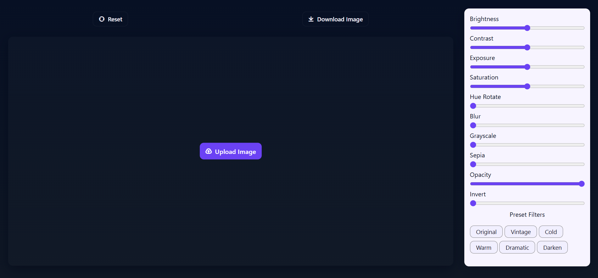

# 🖼️ Image Editor Web App

A modern and responsive Image Editor built using HTML, CSS, and JavaScript.

Users can upload images, apply various filters in real time, use preset effects, reset changes, and download the edited image directly from the browser.

---

## ✨ Features

### Image Upload
- Upload images directly from your device
- Instant image preview

### Editing Controls
- Brightness
- Contrast
- Exposure
- Saturation
- Hue Rotate
- Blur
- Grayscale
- Sepia
- Opacity
- Invert

### Preset Filters
- Original
- Vintage
- Cold
- Warm
- Dramatic
- Darken

### Additional Features
- Reset all filters
- Download edited image
- Responsive design
- Modern UI

---

## 🛠️ Technologies Used

- HTML5
- CSS3
- JavaScript (ES6)
- Canvas API
- Remix Icons

---

## 📂 Project Structure

```text
image-editor-web-app/
│
├── index.html
├── style.css
├── script.js
├── image/
│   ├── UI.png
│
└── README.md
```

---

## 🎯 How to Use

1. Click **Upload Image**
2. Select an image from your device
3. Adjust filters using sliders
4. Try preset filters
5. Click **Download Image** to save the edited image
6. Use **Reset** to restore default settings

---

## 📸 Screenshots



---

## ⚙️ How to Run

### Method 1: Directly

1. Download or clone the repository

```bash
git clone https://github.com/yourusername/image-editor-web-app.git
```

2. Open:

```text
index.html
```

in your browser.

### Method 2: VS Code Live Server

1. Open project folder in VS Code
2. Install Live Server extension
3. Right-click `index.html`
4. Select **Open with Live Server**

---

## 🔮 Future Improvements

- Crop Tool
- Rotate & Flip
- Undo / Redo
- Image Compression
- Multiple Image Support
- Filter Intensity Controls
- Drag & Drop Upload
- Dark/Light Theme Toggle
- Image Comparison Mode
- AI-Based Enhancement

---

## 🤝 Contributing

Contributions, issues, and feature requests are welcome.

Feel free to fork the project and submit a pull request.

---

## 👨‍💻 Author

**Anshu Kharwar**

- GitHub: https://github.com/anshu-Creates
- Email: anshu.builds@gmail.com

---

## ⭐ Support

If you found this project useful, consider giving it a star on GitHub.

```
⭐ Star the repository if you like it!
```

---
